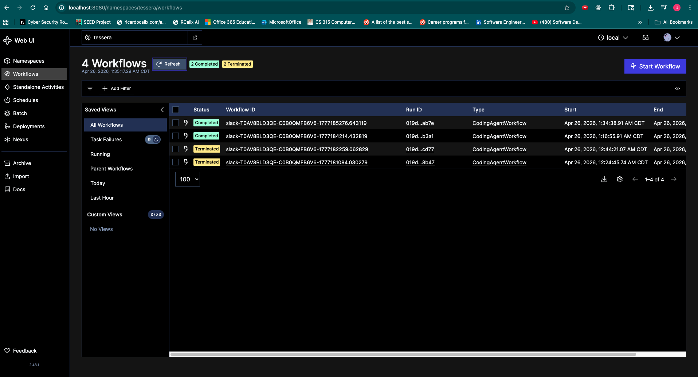

# Tessera Coding Agent — Design Notes (Infrastructure)

## Goal

Stand up the platform infrastructure for a Slack-based coding agent on AWS: durable workflow execution (Temporal on EKS), an isolated data tier (RDS Postgres), zero long-lived credentials (IRSA + GitHub OIDC), and a Helm-packaged application layer — all provisioned by Terraform from this repo.

The application code is intentionally thin; this document focuses on the infrastructure choices that surround it. Application notes are at the bottom.

---

## Infrastructure decisions

### 1. Two-stage Terraform with a hardened state backend

`terraform/bootstrap` provisions the S3 state bucket and DynamoDB lock table that `terraform/main` uses as its backend. The state bucket is versioned, encrypted at rest with AES256, has all four public-access blocks enabled, and is paired with DynamoDB for state locking.

### 2. Three-tier VPC with an isolated data subnet

`10.0.0.0/16` carved into three subnet tiers across two AZs:

| Tier    | Hosts                | Default route       |
|---------|----------------------|---------------------|
| Public  | NAT gateways         | IGW                 |
| Private | EKS worker nodes     | NAT (per-AZ)        |
| Data    | RDS only             | **none** (`local` only) |

The data tier has no `0.0.0.0/0` route, so the database has no path to the internet, only intra-VPC reachability. This limits exfiltration blast radius if the database is ever compromised: an attacker with DB access has no egress path.

One NAT gateway per AZ (two total, two EIPs). Doubles the NAT cost vs. a single shared NAT, but a NAT failure in one AZ doesn't black-hole egress from the other. This is the standard HA-vs-cost lever and I chose HA.

RDS lives in two data subnets across two AZs (required by AWS for any DB subnet group), even though the instance itself is single-AZ.

### 3. EKS managed node group, two AZs

EKS 1.35 with a managed node group of two `t3.medium` instances on `AL2023_x86_64_STANDARD`.

EKS-managed add-ons (`vpc-cni`, `kube-proxy`, `coredns`, `aws-ebs-csi-driver`) are provisioned via the EKS add-on API in Terraform, not Helm. The EBS CSI driver runs under its own IRSA role.

### 4. RDS Postgres for Temporal persistence

Managed RDS Postgres backs Temporal: gp3 storage, AES256 at rest, `manage_master_user_password = true` (credential lives in Secrets Manager and rotates without Terraform touching it), `publicly_accessible = false`, security group accepts ingress only from the EKS worker SG on 5432. Client-side TLS enforced in the Temporal Helm values to satisfy RDS's `rds.force_ssl = 1`.

Trade-off: RDS provisioning is slower than an in-cluster StatefulSet (~10 min on first apply), but the database survives node-group rotation, takes EBS snapshots, and decouples Temporal scaling from persistence.

`multi_az = false` and `backup_retention_period = 0` are deliberate cost cuts for the demo (see *Limitations*).

### 5. Secrets via External Secrets Operator + AWS Secrets Manager

Slack tokens, the Anthropic API key, the GitHub PAT, and the RDS-managed master password all live in AWS Secrets Manager. ESO runs in-cluster with an IRSA role (`tessera-eso`) granting `secretsmanager:GetSecretValue` scoped to those four `tessera/*` secrets plus the RDS-managed entry — nothing wider.

A `ClusterSecretStore` is created once. Each Helm chart declares an `ExternalSecret` that pulls only the keys it needs into a Kubernetes Secret consumed via `envFrom`. Pod templates carry a `checksum/secret` annotation so secret-content changes force a rolling restart.

No secret value lives in git, in `helm template` output, or in container images.

### 6. CI/CD via GitHub Actions OIDC → ECR

A GitHub OIDC provider is registered in AWS IAM. An IAM role (`tessera-gha-ecr-push`) trusts it with a `repo:ugoasoluka/tessera:*` subject condition, scoped to the minimum ECR push and read-verify verbs needed for `docker push` to deduplicate layers and confirm uploads. The build workflow assumes the role at runtime; no static AWS credentials in GitHub secrets, no long-lived access keys to rotate.

ECR repos are `IMMUTABLE` so re-pushing the same tag is a hard error rather than a silent overwrite. `scan_on_push = true` runs the AWS Inspector CVE scan on every image automatically. Daily versioning via `fregante/daily-version-action` produces tags like `v26.4.26`.

### 7. Pod and image security

Pod and container security contexts pass restricted PodSecurity:

- `runAsNonRoot: true`, `runAsUser: 10001`
- `allowPrivilegeEscalation: false`
- `readOnlyRootFilesystem: true`
- `capabilities.drop: ["ALL"]`

Image-side hardening matches: multi-stage builds on `python:3.12-slim`, `tini` as PID 1 for proper signal forwarding and zombie reaping, non-root UID baked in, frozen `uv.lock` for reproducible builds, no shell or package manager added beyond what the base provides. BuildKit cache mounts on `uv` for incremental rebuilds.

### 8. Helm charts kept thin (outbound-only services)

Both app charts share the same skeleton: `Chart.yaml`, `values.yaml`, `_helpers.tpl`, `deployment.yaml`, `externalsecret.yaml`. **No `Service`** — both apps are outbound-only (Slack via Socket Mode WS, Temporal via gRPC client). **No probes** — no HTTP listener; Kubernetes restart-on-exit via container exit code is sufficient liveness. **No `ServiceAccount` override** — neither pod talks to AWS APIs directly, the namespace default SA is fine.

Helm's release Secret lives in the namespace it deploys into, which constrains the cleanup ordering (uninstall before deleting the namespace manifest — documented in `README.md`).

### 9. Slack Socket Mode (no public ingress for the bot)

Socket Mode opens an outbound WebSocket from the bot pod to Slack. No public ingress, no ACM cert, no Route53 record, no Slack signing-secret verification. The bot has zero inbound network surface area and no `Service` of any kind.

### 10. Per-thread Temporal workflow ID = operations identity

`workflow_id = f"slack-{team_id}-{channel_id}-{thread_ts}"`. Temporal enforces ID uniqueness within a namespace, so concurrent Slack threads necessarily produce distinct workflow executions with their own histories, retries, and state.

This is also the **operational identity** for the system — when on-call needs to debug "why didn't a particular Slack request work?", they pull up the Temporal Web UI, paste in `slack-{team}-{channel}-{thread_ts}`, and see every activity, every retry, every payload, every error in chronological order. No correlation IDs to invent, no log scraping across pods.

---

## Privacy and session isolation

- **Per-thread workflow ID.** Temporal enforces uniqueness within a namespace; cross-thread state is impossible by construction.
- **Per-workflow Git branch.** Agent operates on `agent/<sha1(workflow_id)[:10]>`. Two concurrent threads cannot stomp on each other's commits or PRs.
- **Stateless workers.** No inter-activity state in worker memory. Inter-step state lives in workflow history (encrypted at rest in RDS, scoped to the single execution).
- **Idempotent GitHub operations.** `ensure_branch` reuses; `open_pr` returns existing PR. Activity retries cannot produce duplicate PRs or duplicate commits.
- **Secrets reach pods only via env vars** sourced from a Kubernetes Secret that ESO syncs from Secrets Manager. Application code does not read secrets from disk, does not call AWS APIs, and does not log raw values.
- **Logging discipline.** Structured logs include identifiers (workflow ID, thread ID, channel, user ID, prompt length) but never the prompt body or model output.
- **Network isolation.** RDS in the data subnet with no `0.0.0.0/0` route. DB security group accepts ingress only from the EKS worker SG on 5432. Cluster ↔ database traffic is TLS.

Visible in the Temporal Web UI — four concurrent workflow executions, same `team_id` and `channel_id`, different `thread_ts`, fully isolated histories:

---

## Limitations

- **EKS API endpoint is public.** `endpoint_public_access = true, endpoint_private_access = false` so `terraform apply` and `kubectl` can run from a developer laptop without standing up a bastion or VPN. Production should switch to private-only with a transit gateway / VPN, or restrict `public_access_cidrs` to known operator IPs.
- **Single-AZ RDS, no automated backups.** `multi_az = false` and `backup_retention_period = 0`. Failover and recovery are manual; effective RPO is "since the last manual snapshot." Production gets multi-AZ + 7-day retention + deletion protection.
- **No cluster autoscaler.** Node group is fixed at desired=2, max=3. Manual `scaling_config` change to add capacity. Karpenter or `cluster-autoscaler` would be the next step.
- **No PodDisruptionBudget, no HPA.** Single-replica deployments. Brief unavailability during rolling updates is acceptable for the demo.
- **No NetworkPolicies.** In-cluster east-west traffic is open by default. Production should default-deny then explicitly allow `slack-bot → temporal-frontend`, `temporal-worker → temporal-frontend`, and `* → kube-dns`.
- **No probes on app pods.** Both apps are outbound-only with no HTTP listener. Restart-on-exit via container exit code is the only liveness signal.
- **Observability is `kubectl logs` + Temporal Web UI.** No Prometheus, no Grafana, no Loki. Workflow histories are still fully inspectable in the Temporal UI; resource metrics aren't.
- **Single org-level GitHub PAT.** All PRs are attributed to the human who issued the PAT, not to the requesting Slack user. Long-lived org-write credential held by the platform.
- **Helm charts not published.** Installed locally from the repo; chart `version` stays at `0.1.0` since there's no consumer.

---

## Future improvements

Roughly the order I'd tackle them after this milestone:

1. **Production-grade RDS.** `multi_az = true`, `backup_retention_period = 7`, `deletion_protection = true`, parameter group with `log_min_duration_statement` for slow-query visibility.
2. **Default-deny NetworkPolicies** in `tessera-apps` and `temporal` namespaces, then explicit allow rules.
3. **EKS API endpoint private** + a bastion or SSM-tunneled access pattern. Eliminates the public control-plane attack surface.
4. **Cluster autoscaler or Karpenter** for node-level elasticity. Spot node group as a second pool for non-latency-critical workloads.
5. **HPA + PodDisruptionBudget** on the temporal-worker deployment once load characteristics are known.
6. **Observability stack.** Prometheus + Grafana + Tempo (or any OTel-compatible collector). Pydantic AI + Temporal both expose OTel hooks already.
7. **EBS CSI / VPC CNI / kube-proxy / coredns version pins** in Terraform; currently using EKS-managed defaults which can drift on cluster upgrade.
8. **Per-user GitHub App OAuth** — replaces the single org-level PAT so PRs are attributable to the requesting human.

---

## Application runtime notes

A few software-side choices with deployment implications:

- **Agent runs end-to-end inside a single Temporal activity.** One activity boundary, one set of retries; on failure the next attempt re-runs from the user's prompt rather than mid-loop. Idempotency comes from deterministic branch names and PR-reuse logic.
- **Each Slack message starts a new workflow run.** In-thread follow-ups don't carry conversational state into the agent. A future iteration would keep the workflow alive on a `wait_condition` + idle timer and use `continue_as_new` to bound history.
- **Temporal workflow sandbox is disabled** (`UnsandboxedWorkflowRunner`). Pydantic AI's transitive deps (`beartype.claw` via `cyclopts` / `fastmcp`) install a process-wide import hook that breaks the sandbox's controlled re-import. The workflow body is a pair of `execute_activity` calls and a return — deterministic by construction — so the sandbox provides no real protection here.
- **LLM provider is configurable.** Currently `anthropic:claude-haiku-4-5-20251001`. Switching providers is a one-line change in `helm/temporal-worker/values.yaml` plus an env-var rename in the `ExternalSecret`.
