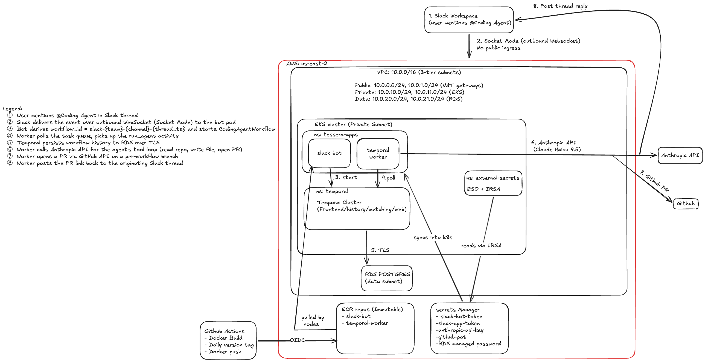
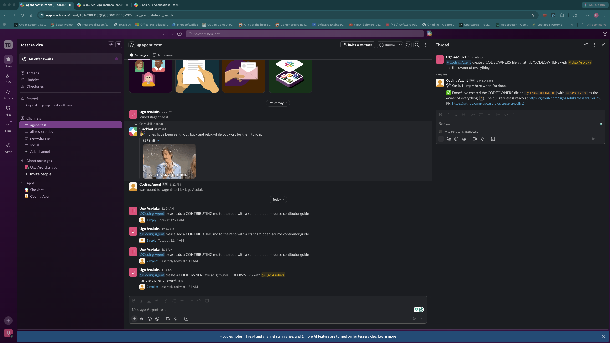
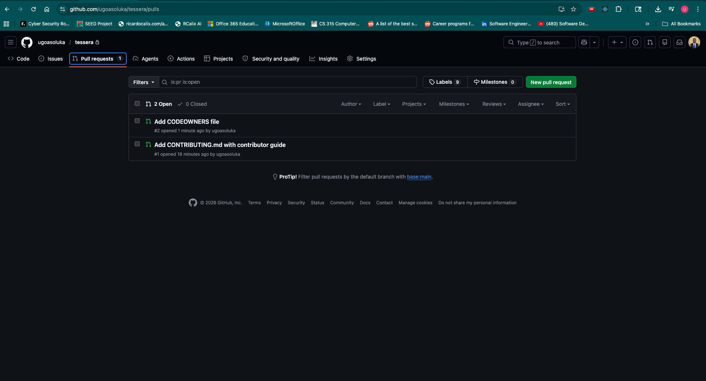

# Tessera Coding Agent Platform

A Slack-based coding assistant that orchestrates LLM-driven code changes through durable Temporal workflows on AWS EKS, opens GitHub pull requests, and posts the result back to the originating Slack thread.

## Architecture



The user mentions the bot in a Slack thread. Slack delivers the event over an outbound WebSocket (Socket Mode — no public ingress to the cluster). The bot derives a workflow ID from the thread (`slack-{team}-{channel}-{thread_ts}`) and starts a Temporal workflow. The temporal-worker polls the task queue, picks up the activity, and runs a Pydantic AI agent that reads the repo, writes commits to a per-workflow branch, and opens a pull request via the GitHub API. The worker then posts the PR link back to the originating Slack thread.

Workflow state persists in RDS Postgres (in a dedicated data subnet). Application secrets live in AWS Secrets Manager and are pulled into Kubernetes by the External Secrets Operator using IRSA; no AWS credentials in pod environments. Container images are built by GitHub Actions (assuming an OIDC role into AWS) and pushed to immutable ECR repos.

> **For design rationale and trade-offs, see [`DESIGN.md`](./DESIGN.md).**

## Repository layout

```
.
├── DESIGN.md                   # decisions, trade-offs, limitations, future work
├── README.md                   # this file
├── docs/
│   └── architecture.png
├── apps/
│   ├── slack-bot/              # Bolt + Socket Mode -> Temporal client
│   └── temporal-worker/        # Pydantic AI agent + Temporal worker
├── helm/
│   ├── external-secrets/       # External Secrets Operator (deps: charts.external-secrets.io)
│   ├── temporal/               # Temporal server (deps: go.temporal.io/helm-charts)
│   ├── slack-bot/              # in-house chart for the bot
│   └── temporal-worker/        # in-house chart for the worker
├── terraform/
│   ├── bootstrap/              # S3 + DynamoDB for the remote backend
│   └── main/                   # VPC, EKS, RDS, ECR, IAM (incl. GitHub OIDC), Secrets Manager
└── .github/workflows/
    └── build-and-push.yml    # GitHub Actions → OIDC → ECR push
```

## Stack

**Infrastructure (Terraform).** AWS in `us-east-2`. State backend is S3 + DynamoDB. The network is a 3-tier VPC: public (NAT gateways), private (EKS workers), and a data tier (RDS lives here). EKS 1.35 runs on two `t3.medium` nodes. Two immutable ECR repos. Secrets in AWS Secrets Manager. A dedicated IAM role with GitHub OIDC trust lets CI push images without long-lived AWS keys.

**Cluster add-ons.** EKS-managed add-ons (`vpc-cni`, `kube-proxy`, `coredns`, `aws-ebs-csi-driver`) are provisioned by Terraform via the EKS add-on API. Application-level add-ons go through Helm: External Secrets Operator (with IRSA, syncs Secrets Manager values into Kubernetes), and Temporal Server from the community chart, backed by RDS Postgres over TLS.

**Applications.** Two Python services as separate `uv` projects, each with its own Dockerfile and Helm chart. The `slack-bot` runs Bolt in Socket Mode — outbound WebSocket only, no inbound listener. The `temporal-worker` polls the task queue and runs a Pydantic AI agent (Anthropic Claude) inside a single Temporal activity, posting results back to the originating Slack thread.

**CI/CD.** GitHub Actions assumes an OIDC role into AWS, builds both images on `linux/amd64`, tags with a daily version (`v26.4.26`), and pushes to ECR.

---

## Prerequisites

- AWS account. Region is `us-east-2`.
- A free Slack workspace and a Slack app with **Socket Mode enabled**, scopes `app_mentions:read`, `chat:write`, `channels:history`, plus an app-level token (`xapp-…`). The bot token is `xoxb-…`.
- A GitHub repo the agent can PR into, plus a fine-grained PAT with `Contents: Read & Write` and `Pull requests: Read & Write` on that repo.
- An Anthropic API key (paid tier). The default model is `claude-haiku-4-5`; configurable via `helm/temporal-worker/values.yaml`.
- Local tools: `terraform >= 1.5`, `kubectl`, `helm >= 3.13`, `aws` CLI v2

---

## Install

The repo expects to be cloned somewhere convenient and the AWS CLI to have credentials in the chosen profile.

```bash
git clone https://github.com/ugoasoluka/tessera.git
cd tessera

aws sts get-caller-identity   # confirm correct account/profile
aws configure set region us-east-2
```

---

## Deploy

The deploy is four passes: bootstrap → main infra → cluster add-ons → app charts. Each step is idempotent and re-runnable.

### 1. Bootstrap the Terraform remote backend

Creates the S3 state bucket and DynamoDB lock table that `terraform/main` uses for remote state and locking.

```bash
cd terraform/bootstrap
terraform init
terraform apply        # answer "yes" at the prompt
cd ../..
```

You should see 5 resources created: an S3 bucket with versioning, server-side encryption, and public-access blocking, plus a DynamoDB lock table.

### 2. Apply the main infrastructure

Provisions VPC (3-tier subnets), EKS cluster + node group, RDS Postgres, ECR repos, IAM roles (including the GitHub Actions OIDC role for ESO and EBS CSI driver), and the four AWS Secrets Manager entries with placeholder values.

```bash
cd terraform/main
terraform init
terraform apply  # answer "yes" at the prompt
cd ../..
```

Capture the GitHub Actions role ARN — you'll paste it into the workflow file in step 6:

```bash
terraform -chdir=terraform/main output github_actions_role_arn
# → arn:aws:iam::<acct>:role/tessera-gha-ecr-push
```

Wire `kubectl` to the new cluster:

```bash
aws eks update-kubeconfig --region us-east-2 --name tessera
kubectl get nodes   # expect 2 Ready nodes
```

### 3. Populate the Secrets Manager values

Terraform created the secrets with `PLACEHOLDER_REPLACE_ME`. Fill them in:

```bash
for kv in \
  "tessera/slack-bot-token=xoxb-..." \
  "tessera/slack-app-token=xapp-..." \
  "tessera/anthropic-api-key=sk-ant-api03-..." \
  "tessera/github-pat=github_pat_..."; do
  name="${kv%%=*}"; value="${kv#*=}"
  aws secretsmanager put-secret-value --secret-id "$name" --secret-string "$value" >/dev/null
done
```

### 4. Configure Helm values

Six places in the repo reference values that are unique to each AWS account or RDS instance. Capture them from Terraform/AWS and substitute before any `helm install`.

```bash
# Capture all the per-account values up front.
ESO_ROLE_ARN=$(terraform -chdir=terraform/main output -raw eso_role_arn)
RDS_ENDPOINT=$(terraform -chdir=terraform/main output -raw rds_temporal_endpoint)
RDS_SECRET_NAME=$(aws secretsmanager list-secrets \
  --query 'SecretList[?starts_with(Name, `rds!db-`)].Name | [0]' \
  --output text)
ECR_REGISTRY=$(aws sts get-caller-identity --query Account --output text).dkr.ecr.us-east-2.amazonaws.com
GHA_ROLE_ARN=$(terraform -chdir=terraform/main output -raw github_actions_role_arn)

echo "ESO role ARN:     $ESO_ROLE_ARN"
echo "RDS endpoint:     $RDS_ENDPOINT"
echo "RDS secret name:  $RDS_SECRET_NAME"
echo "ECR registry:     $ECR_REGISTRY"
echo "GHA role ARN:     $GHA_ROLE_ARN"
```

You'll paste these into the following files:

**`helm/external-secrets/values.yaml`** — set the IRSA role ARN on the ServiceAccount so ESO can read from Secrets Manager:

```yaml
external-secrets:
  serviceAccount:
    annotations:
      eks.amazonaws.com/role-arn: <ESO_ROLE_ARN>
```

**`helm/temporal/values.yaml`** — set the RDS endpoint on **both** datastores (default and visibility):

```yaml
temporal:
  server:
    config:
      persistence:
        datastores:
          default:
            sql:
              connectAddr: "<RDS_ENDPOINT>:5432"
              # ... other fields unchanged
          visibility:
            sql:
              connectAddr: "<RDS_ENDPOINT>:5432"
              # ... other fields unchanged
```

**`helm/temporal/external-secret.yaml`** — set the RDS-managed secret name (the `rds!db-<uuid>` string from the capture above):

```yaml
data:
  - secretKey: password
    remoteRef:
      key: '<RDS_SECRET_NAME>'
      property: password
```

**`helm/slack-bot/values.yaml`** and **`helm/temporal-worker/values.yaml`** — set the image repository to your ECR registry. The image tag will be set after CI runs (step 6):

```yaml
image:
  repository: <ECR_REGISTRY>/tessera-slack-bot      # or tessera-temporal-worker
  tag: <set-in-step-7>
```

**`helm/temporal-worker/values.yaml`** — also set the GitHub repo the agent will operate on:

```yaml
github:
  repo: <your-org>/<your-sandbox-repo>
```

**`.github/workflows/build-and-push.yml`** — set the GitHub Actions OIDC role ARN:

```yaml
env:
  AWS_ROLE_ARN: <GHA_ROLE_ARN>
```

### 5. Install cluster add-ons

Two add-ons are installed via Helm: External Secrets Operator (which syncs Secrets Manager → Kubernetes Secrets) and Temporal Server (which runs against RDS). The EKS-managed add-ons (`vpc-cni`, `kube-proxy`, `coredns`, `aws-ebs-csi-driver`) are already installed by Terraform in step 2 — no action needed for those.

```bash
# External Secrets Operator (CRDs + controller)
helm dep update helm/external-secrets
helm upgrade --install tessera-external-secrets helm/external-secrets \
  -n external-secrets --create-namespace
```

Verify ESO came up:

```bash
kubectl -n external-secrets get pods
# expect 3 Running pods: external-secrets, cert-controller, webhook
```

Apply the Temporal namespace and the ExternalSecret that pulls the RDS-managed master password into the cluster:

```bash
kubectl apply -f helm/temporal/external-secret.yaml

kubectl -n temporal get externalsecret tessera-temporal-db
# wait for STATUS=SecretSynced before proceeding
```

Install the Temporal server (frontend, history, matching, worker, web UI, admintools, plus a one-shot schema-setup Job):

```bash
helm dep update helm/temporal
helm upgrade --install tessera-temporal helm/temporal \
  -n temporal --wait --timeout 10m
```

The schema-setup Job runs as a Helm pre-install hook, creates the `temporal` and `temporal_visibility` databases in RDS, loads the schema, and exits. After it completes, the server pods come up.

```bash
kubectl -n temporal get pods
# expect: admintools, frontend, history, matching, worker, web — all 1/1 Running
# (you may also see a Completed schema-setup pod, that's expected)
```

Register a Temporal namespace for the application:

```bash
kubectl -n temporal exec deploy/tessera-temporal-admintools -- \
  temporal operator namespace create \
    --namespace tessera \
    --retention 7d \
    --address tessera-temporal-frontend:7233
# expect: "Namespace tessera successfully registered."
```

Optionally, port-forward the Temporal Web UI to verify everything looks healthy:

```bash
kubectl -n temporal port-forward svc/tessera-temporal-web 8080:8080
# open http://localhost:8080, switch namespace dropdown to "tessera"
```

### 6. Build & push the app images

Both Docker images are built and pushed to ECR by GitHub Actions, using the OIDC role provisioned in step 2. No long-lived AWS keys are used.

Push the repo to GitHub if you haven't already:

```bash
git push -u origin main
```

Open `.github/workflows/build-and-push.yml` and confirm `AWS_ROLE_ARN` matches the value you captured in step 2:

```yaml
env:
  AWS_REGION: us-east-2
  AWS_ROLE_ARN: arn:aws:iam::<account>:role/tessera-gha-ecr-push
  ECR_REPO_PREFIX: tessera
```

Then in the GitHub UI: **Actions → Docker Image Build and Push → Run workflow**, leave **app: all** selected, and run.

The workflow assumes the OIDC role, builds both images on `linux/amd64`, applies a daily-version tag (`v26.4.26`), and pushes to ECR.

Verify the images are in ECR:

```bash
aws ecr describe-images --repository-name tessera-slack-bot \
  --query 'imageDetails[*].imageTags[0]' --output text
aws ecr describe-images --repository-name tessera-temporal-worker \
  --query 'imageDetails[*].imageTags[0]' --output text
# expect a tag in each, e.g. v26.4.26
```

Note the tag — you'll set it in the Helm values in the next step.

### 7. Install the app charts

Now that the images are in ECR, set the `image.tag` in both app charts' `values.yaml` to whatever CI just pushed (e.g. `v26.4.26`). The image repository was already set in step 4, so this is the last edit before deploying:

```yaml
# helm/slack-bot/values.yaml AND helm/temporal-worker/values.yaml
image:
  repository: <ECR_REGISTRY>/tessera-slack-bot         # already set in step 4
  tag: v26.4.26                                        # ← set this
```

Install both charts in parallel — they're independent and don't share state:

```bash
helm upgrade --install tessera-slack-bot       ./helm/slack-bot       -n tessera-apps --create-namespace --wait --timeout 5m &
helm upgrade --install tessera-temporal-worker ./helm/temporal-worker -n tessera-apps                     --wait --timeout 5m &
wait
```

Watch the rollout:

```bash
kubectl -n tessera-apps get pods
# expect:
# tessera-slack-bot-...         1/1 Running
# tessera-temporal-worker-...   1/1 Running
```

Tail logs to confirm both services connected to Temporal:

```bash
kubectl -n tessera-apps logs deploy/tessera-temporal-worker --tail=10
# look for: "event": "worker.connecting" then "event": "worker.started"

kubectl -n tessera-apps logs deploy/tessera-slack-bot --tail=10
# look for: "event": "temporal.connected" then "event": "bot.starting" then "⚡️ Bolt app is running!"
```

The bot maintains an outbound WebSocket to Slack via Socket Mode — no inbound networking, no Service or Ingress required.

---

## Run

In the Slack workspace, invite the bot to a channel and mention it in a thread:

> @Coding Agent please add a CONTRIBUTING.md to the repo with a quick "how to open a PR" section

Expected sequence — watch it live across three terminals:

```bash
# Bot logs: ack the mention, start the workflow
kubectl -n tessera-apps logs -f deploy/tessera-slack-bot

# Worker logs: pick up the activity, run the agent, open the PR
kubectl -n tessera-apps logs -f deploy/tessera-temporal-worker

# Temporal Web UI: see the workflow execution and its history
kubectl -n temporal port-forward svc/tessera-temporal-web 8080:8080
# open http://localhost:8080, switch namespace dropdown to "tessera"
# the workflow ID is slack-<team>-<channel>-<thread_ts>
```

In Slack, the bot replies twice in the thread: an immediate `:hammer_and_wrench: On it.` ack, then ~30 seconds later a `:white_check_mark:` message with the PR link.

**Concurrent test (session isolation):** post two top-level mentions in the same channel within a few seconds of each other. The Temporal UI shows two workflow executions running in parallel — same `team_id` and `channel_id`, different `thread_ts` — proving per-thread isolation.

### Verified end-to-end

A representative successful run from the build:

```
06:16:55  app_mention.received       (Slack thread 1777184214.432819)
06:16:56  workflow.started           workflow_id=slack-T0AV...-C0B0...-1777184214.432819
06:16:56  agent_activity.start
06:16:56  POST api.anthropic.com → 200      ← tool call #1 (list repo files)
06:17:02  POST api.anthropic.com → 200      ← #2 (read existing files for context)
06:17:09  POST api.anthropic.com → 200      ← #3 (write CONTRIBUTING.md)
06:17:16  POST api.anthropic.com → 200      ← #4 (commit on per-workflow branch)
06:17:24  POST api.anthropic.com → 200      ← #5 (open PR)
06:17:24  agent_activity.done        pr_url=https://github.com/.../pull/1
06:17:25  slack_post.done            (PR link posted in the originating thread)
```

Wall time from `@mention` to PR link: ~30 seconds for a 5-tool-call agent run.

#### Evidence

The bot in action — `@Coding Agent` mentions in a Slack channel, with the bot acknowledging and posting back PR links once each run completes:



The Temporal Web UI showing four distinct concurrent workflow executions, all `CodingAgentWorkflow`, each with a workflow ID derived from a different Slack thread. Same `team_id`, same `channel_id`, different `thread_ts` — proof of per-thread session isolation:


The GitHub side — two pull requests on `ugoasoluka/tessera`, both opened by the agent on per-workflow branches:



---

## Cleanup

Reverse order of deploy: app charts → cluster add-ons → namespaces → ECR images → Terraform.

```bash
# 1. App charts
helm uninstall tessera-slack-bot       -n tessera-apps
helm uninstall tessera-temporal-worker -n tessera-apps
kubectl delete namespace tessera-apps

# 2. Cluster add-ons. Uninstall Helm releases BEFORE deleting the namespace
#    manifest — Helm 3 stores release state as a Secret in the release's
#    namespace, so deleting the namespace first orphans the release.
helm uninstall tessera-temporal         -n temporal
helm uninstall tessera-external-secrets -n external-secrets
kubectl delete -f helm/temporal/external-secret.yaml --ignore-not-found
kubectl delete namespace temporal external-secrets --ignore-not-found

# 3. ECR images (the repos have IMMUTABLE tags; force_delete=true on the
#    Terraform side handles destroying repos that still contain images,
#    but emptying them first is faster and avoids confusing `terraform destroy` output)
for repo in tessera-slack-bot tessera-temporal-worker; do
  IDS=$(aws ecr list-images --region us-east-2 --repository-name $repo \
    --query 'imageIds[*]' --output json)
  if [ "$IDS" != "[]" ]; then
    aws ecr batch-delete-image --region us-east-2 --repository-name $repo \
      --image-ids "$IDS" >/dev/null
  fi
done

# 4. Main infrastructure (VPC, EKS, RDS, ECR, IAM, Secrets Manager)
cd terraform/main
terraform destroy
cd ../..

# 5. Backend (state bucket + lock table)
cd terraform/bootstrap
terraform destroy
cd ../..
```

`terraform destroy` on the main module takes ~10-15 minutes (EKS deletion is the slow part). Secrets Manager entries are removed with `recovery_window_in_days=0`, so they delete immediately rather than entering the default 7-day soft-delete window.